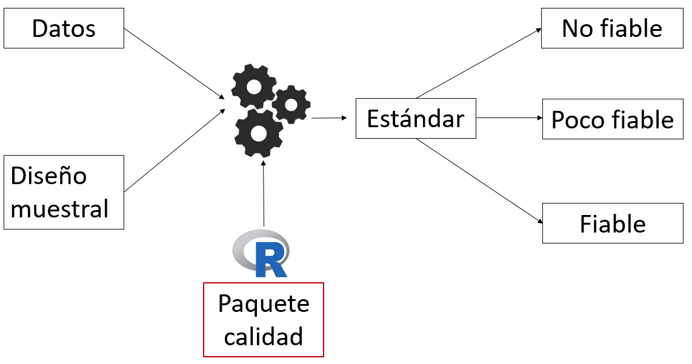
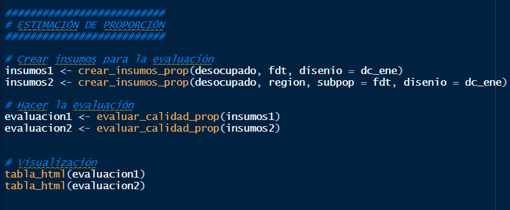
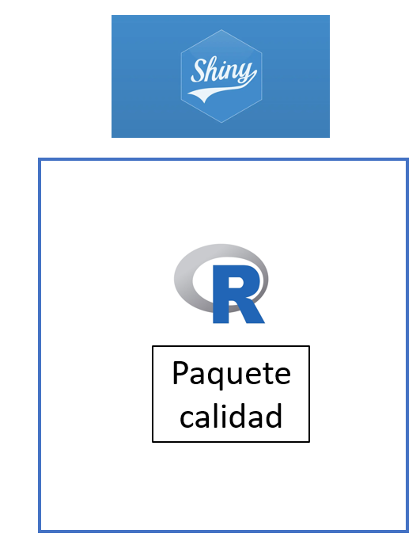

class: center, middle

.linea-superior[]
.linea-inferior[]


## Propuesta de aplicación shiny para la evaluación de calidad

## Proyecto Estratégico de Servicios Compartidos

### Enero 2021


```{r setup, include=FALSE}
options(htmltools.dir.version = FALSE)
knitr::opts_chunk$set(message = FALSE) 
```

```{r xaringan-themer, include=FALSE, warning=FALSE}
library(xaringanthemer)
#style_duo_accent(
 # primary_color = "#1381B0",
  #secondary_color = "#FF961C",
  #inverse_header_color = "#FFFFFF"
#)
```


---
background-image: url("imagenes/fondo2.PNG")
background-size: contain;
background-position: 100% 0%

# El paquete calidad 


<br>

.center[


]


---
background-image: url("imagenes/fondo2.PNG")
background-size: contain;
background-position: 100% 0%

# Uso del paquete calidad

Pondremos a disposición funciones que aplican el estándar de manera sencilla

.center[


]


---

background-image: url("imagenes/fondo2.PNG")
background-size: contain;
background-position: 100% 0%

#  Uso del paquete calidad

```{r, echo=FALSE, message=FALSE, fig.align='center'}
library(calidad)
library(tidyverse)
ene <- ene %>%
  mutate(ocupado = if_else(cae_especifico >= 1 & cae_especifico <= 7, 1, 0),
         fdt = if_else(cae_especifico >= 1 & cae_especifico <=9, 1, 0 ),
         desocupado = if_else(cae_especifico >= 8 & cae_especifico <= 9, 1, 0))

options(survey.lonely.psu = "certainty")
dc_ene <- survey::svydesign(ids = ~conglomerado, strata = ~estrato_unico, data = ene, weights = ~fact_cal)

insumos <- crear_insumos_tot(desocupado, region, subpop = fdt,  disenio = dc_ene)
evaluacion <- evaluar_calidad_tot(insumos, publicar = T)
tabla_html(evaluacion %>% select(-se, -eval_n) %>% slice(1:6))

```

---

background-image: url("imagenes/fondo2.PNG")
background-size: contain;
background-position: 100% 0%

# Barreras de entrada


- Tener `R` instalado en el computador

- Conocimiento básico del lenguaje 


--

### Nos gustaria que la mayor cantidad de personas posible usara el paquete calidad


.center[


]


---

background-image: url("imagenes/fondo2.PNG")
background-size: contain;
background-position: 100% 0%

# Paquete calidad y shiny


`Shiny` es un paquete de `R` que permite generar aplicaciones de manera sencilla


.center[


]

--

Estamos usando el paquete calidad dentro de shiny


---
background-image: url("imagenes/fondo2.PNG")
background-size: contain;
background-position: 100% 0%


class: center, middle

.big-font[
¡Veamos la aplicación!
]


---

background-image: url("imagenes/fondo2.PNG")
background-size: contain;
background-position: 100% 0%

# Próximos pasos

**Paquete calidad**

- Incorporar comentarios de SDT y de Subdepartamento de Marcos y Muestras (están llegando)

--

- Evaluar incorporación de precisión para la mediana (sugerencia de Subdepartamento de Marcos y Muestras)

--

- Coordinar apoyo del Departamento de Metodología    

--

- Traducir documentación a inglés (requisito para entrar a CRAN) 

--

**Shiny**

- Optimizar las funcionalidades actuales 

--

- Evaluar incorporación de nuevas funcionalidades

--

- Coordinación con SDTI, para asegurar la calidad de la aplicación


---

class: center, middle

.linea-superior[]
.linea-inferior[]


## Propuesta de aplicación shiny para la evaluación de calidad

## Proyecto Estratégico de Servicios Compartidos

### Enero 2021

